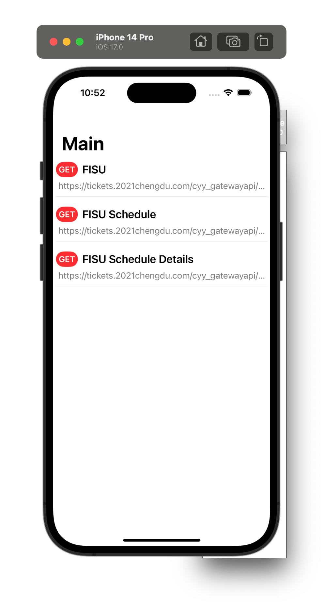
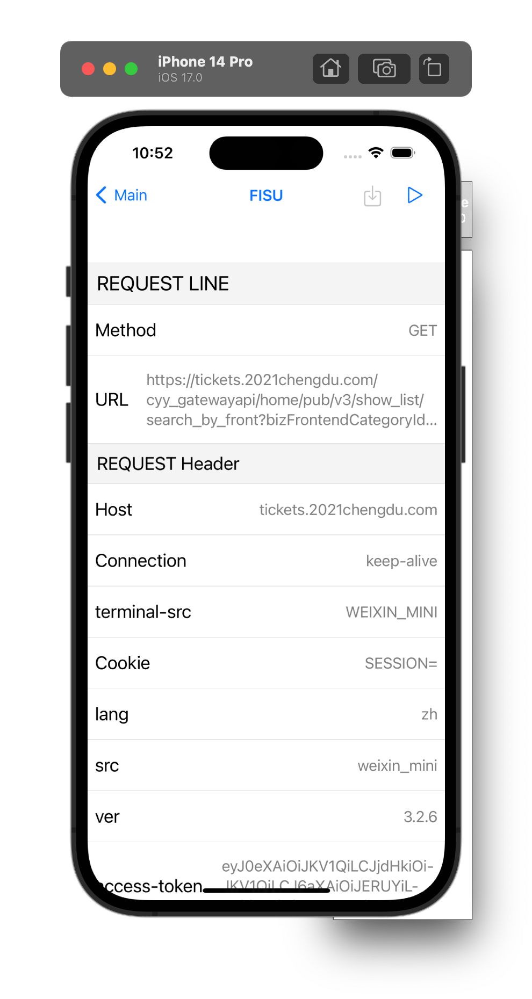
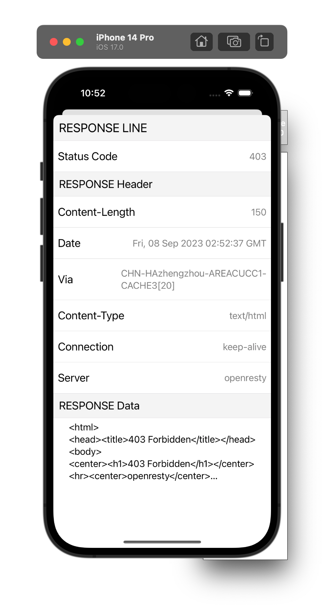
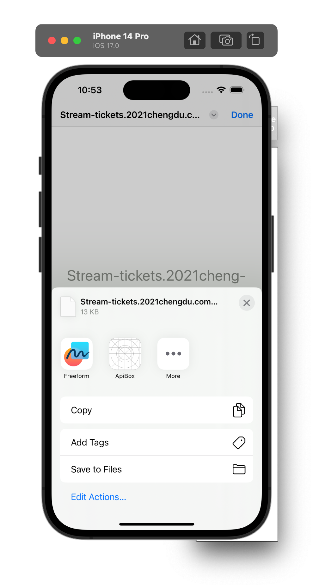
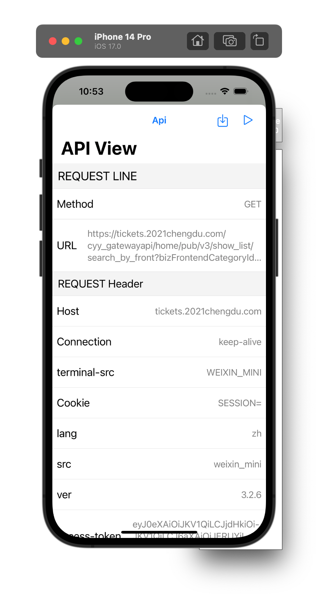
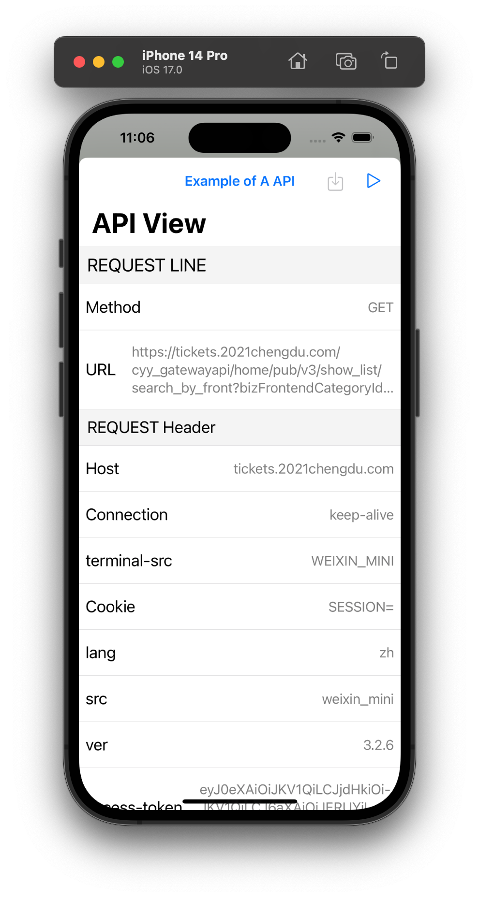
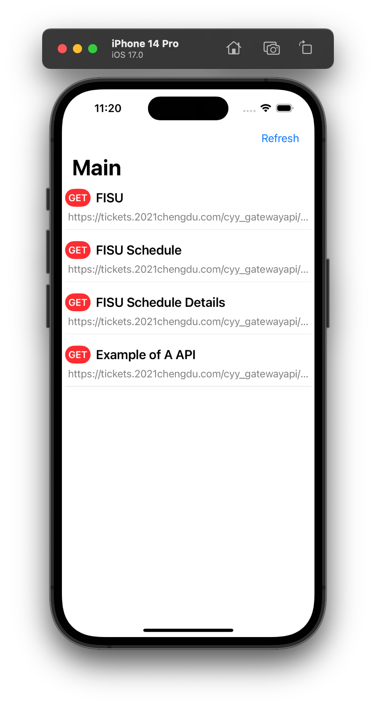

# IOS项目，API盒子
> 为了有效的保存和调用api，支持从其他网络调试工具分享的har文件保存api

- [x] 显示request
- [x] 显示response
- [x] 支持保存分享的http请求
- [ ] 桌面widget小组件显示
- [ ] 桌面widget小组件调用

  
   
  mainview.png

  
   
  detailview_request.png

  
   
  detailview_response.png

  
   
  otherapp_sharesheet.png

  
   
  otherapp_sharesheet_save.png

  
   
  otherapp_sharesheet_saved.png

  
   
  updated_mainview.png

